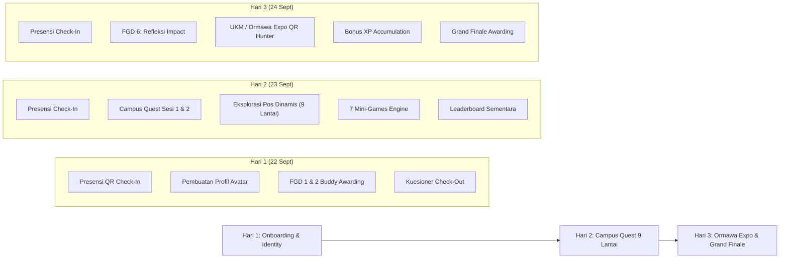

# 📚 Dokumentasi Pengembangan GENIUS UNU 2026
### *Gedung Edukasi Navigasi Interaktif Universitas Nahdlatul Ulama Yogyakarta*
> **Tema Kegiatan:** *"Upgrade New U 2026"*  
> **Target Pengguna:** Mahasiswa Baru (MABA), Buddy (Pendamping Kelompok), PJ Lantai/Pos, Ormawa/UKM, dan Panitia Inti PKKMB UNU Yogyakarta 2026.

---

## 🧭 Daftar Isi Dokumentasi (Documentation Index)

Dokumentasi ini disusun secara komprehensif untuk memandu seluruh tahapan pengembangan arsitektur, backend database NoSQL (MongoDB Atlas), frontend aplikasi mahasiswa (Vue.js), dashboard admin & panitia, serta integrasi alur acara 3 hari orientasi kampus.

| No | Dokumen | Fokus & Isi Pembahasan |
| :---: | :--- | :--- |
| **01** | [**01-RUNDOWN-DAN-EVENT-FLOW.md**](./01-RUNDOWN-DAN-EVENT-FLOW.md) | **Pemetaan Rundown Acara 3 Hari ke Fitur Aplikasi:** Check-in presensi Hari 1-3, FGD 1 & 2 Buddy Point Awarding, Campus Quest 9 Lantai (Hari 2), UKM/Ormawa Expo Bonus XP (Hari 3), dan Closing Awarding. |
| **02** | [**02-ARSITEKTUR-DAN-TECH-STACK.md**](./02-ARSITEKTUR-DAN-TECH-STACK.md) | **Spesifikasi Arsitektur Sistem & Tech Stack:** NoSQL MongoDB Atlas, Node.js REST API Backend, Vue 3 / Nuxt 3 Frontend, Shared Types Monorepo, serta Diagram Topologi & Data Flow. |
| **03** | [**03-SKEMA-DATABASE-MONGODB.md**](./03-SKEMA-DATABASE-MONGODB.md) | **Dokumentasi Skema Koleksi MongoDB Atlas:** BSON Models untuk Users, Admins, Attendances (Presensi), FGD Evaluations, Dynamic Checkpoints (Pos), Game Modules, Stamps, Ormawa Booths & Scans, dan Leaderboards. |
| **04** | [**04-SPESIFIKASI-FITUR-UTAMA.md**](./04-SPESIFIKASI-FITUR-UTAMA.md) | **Spesifikasi Detail Fitur:** Presensi QR Dinamis, Portal Penilaian Buddy (FGD), Dynamic Campus Quest & Question Bank Builder, 7 Core Engine Mini-Game, UKM Expo Discovery QR, dan Live Leaderboard Projector. |
| **05** | [**05-SPESIFIKASI-REST-API.md**](./05-SPESIFIKASI-REST-API.md) | **Kontrak REST API Backend Lengkap:** Endpoint Auth, Presensi, Buddy Scoring, Quest/Games, Stempel, Manajemen Pos & Soal Admin, Ormawa QR Scan, serta Leaderboard & Statistik. |
| **06** | [**06-AUDIT-PROGRESS-SAAT-INI.md**](./06-AUDIT-PROGRESS-SAAT-INI.md) | **Audit Status Implementasi & Gap Analysis:** Inventarisasi kondisi riil repositori saat ini (Mock in-memory, UI Prototype) versus kebutuhan target production. |
| **07** | [**07-ROADMAP-PENGEMBANGAN.md**](./07-ROADMAP-PENGEMBANGAN.md) | **Roadmap & Rencana Eksekusi Bertahap:** 7 Tahap pengembangan terstruktur mulai dari koneksi database, integrasi presensi, portal buddy, quest engine dinamis, hingga load testing 1000+ MABA. |
| **08** | [**08-PANDUAN-MODUL-GAME-DAN-KONTRIBUSI.md**](./08-PANDUAN-MODUL-GAME-DAN-KONTRIBUSI.md) | **Panduan Modul Game & Kontribusi:** Standar arsitektur plug-and-play untuk 7 modul mini-game gamifikasi orientasi kampus. |
| **09** | [**09-PENYELARASAN-FLOW-FRONTEND-3-HARI.md**](./09-PENYELARASAN-FLOW-FRONTEND-3-HARI.md) | **Penyelarasan Alur Pengalaman Pengguna (UX Flow):** Pemetaan detail perjalanan maba Hari 1 s.d. Hari 3. |
| **10** | [**10-PANDUAN-IMPLEMENTASI-FRONTEND-LENGKAP.md**](./10-PANDUAN-IMPLEMENTASI-FRONTEND-LENGKAP.md) | **Panduan Implementasi Frontend Lengkap:** Integrasi antarmuka User Maba dan Backoffice Admin dengan tema Retro RPG. |
| **11** | [**11-SISTEM-PRESENSI-SESI-FLEKSIBEL.md**](./11-SISTEM-PRESENSI-SESI-FLEKSIBEL.md) | **Sistem Presensi Sesi Dinamis:** Arsitektur sesi check-in & check-out fleksibel dengan QR token putar dan anti-titip absen. |
| **12** | [**12-RATIONALE-TECH-STACK-POSTGRESQL-VS-MONGODB.md**](./12-RATIONALE-TECH-STACK-POSTGRESQL-VS-MONGODB.md) | **Rationale Arsitektur Database & Tech Stack:** Analisis teknis mendalam mengapa proyek menggunakan PostgreSQL + Drizzle ORM + Elysia/Bun daripada NoSQL/MongoDB. |
| **13** | [**13-PEMETAAN-QUIZ-DATABASE-DAN-CORE-GAMEPLAY.md**](./13-PEMETAAN-QUIZ-DATABASE-DAN-CORE-GAMEPLAY.md) | **Pemetaan Kuis Resmi & Core Gameplay:** Penyelarasan kata-per-kata 51 butir soal dari `quiz_database.csv`, bobot poin presisi (100 Pts/pos), dan integrasi media Google Drive. |
| **14** | [**14-PANDUAN-SEED-DAN-CRUD-ADMIN-KUIS.md**](./14-PANDUAN-SEED-DAN-CRUD-ADMIN-KUIS.md) | **Panduan Eksekusi Seeder & CRUD Kuis Admin:** Operasional eksekusi seeder (clean-slate vs official), akun default, penyematan iframe Google Drive, dan manajemen bank soal. |

---

## 🎯 Visi & Konsep Gamifikasi GENIUS UNU 2026

Aplikasi **GENIUS UNU 2026** dirancang bukan sekadar sebagai aplikasi presensi biasa, melainkan platform **Eksplorasi Gamifikasi Interaktif (Retro RPG Stardew Valley Theme)** yang mendampingi mahasiswa baru selama 3 hari penuh rangkaian PKKMB:



---

## 🛠️ Ringkasan Target Tech Stack
 
Sesuai evaluasi kebutuhan integritas data dan performa tinggi (lihat [Dokumen 12](./12-RATIONALE-TECH-STACK-POSTGRESQL-VS-MONGODB.md)), stack produksi yang digunakan:
 
* **Basis Data:** **PostgreSQL + PGlite (Embedded WASM)** — Relasional dengan transaksi ACID penuh, constraint integritas finansial skor gamifikasi, dan kolom hybrid `JSONB` untuk konfigurasi mini-game fleksibel. PGlite memungkinkan zero-config local development tanpa Docker/service eksternal.
* **Backend:** **ElysiaJS + Bun Runtime + Drizzle ORM** — RESTful API & WebSocket service ultra-cepat (> 200k req/s), stateless JWT auth, TypeBox JIT validation, dan end-to-end type safety dengan frontend.
* **Frontend Mahasiswa (`frontend/user`):** **Vue 3 (Composition API `<script setup lang="ts">`) + Vite + Tailwind CSS v4** — PWA Mobile-first interaktif bertema Retro RPG, visual paspor stempel, audio synthesizer Web Audio API, QR Scanner kamera, dan 7 modul mini-game.
* **Frontend Admin & Panitia (`frontend/admin`):** **Vue 3 + Vite + Tailwind CSS v4** — Backoffice portal untuk Super Admin, PJ Lantai, dan Buddy dengan fitur live monitoring, builders pos & soal, evaluasi FGD, QR generator, dan mode proyektor leaderboard.
* **Shared Types (`packages/shared`):** Shared TypeScript contracts & DTOs untuk memastikan *type safety* end-to-end.

---

## 🚀 Panduan Memulai Cepat (Quick Start)

```bash
# 1. Clone & install dependencies pada monorepo
bun install

# 2. Konfigurasi Environment Variable Backend (.env)
# MONGODB_URI=mongodb+srv://<user>:<password>@cluster.mongodb.net/genius_unu_2026

# 3. Jalankan seluruh service secara paralel
bun run dev

# Atau jalankan service secara terpisah:
bun run dev:user      # http://localhost:3000 (User App - MABA)
bun run dev:admin     # http://localhost:3002 (Admin Dashboard)
bun run dev:backend   # http://localhost:3001 (API Backend)
```

---
*Dokumentasi ini dikelola secara terpusat untuk Kepanitiaan PKKMB 2026 Universitas Nahdlatul Ulama Yogyakarta.*
